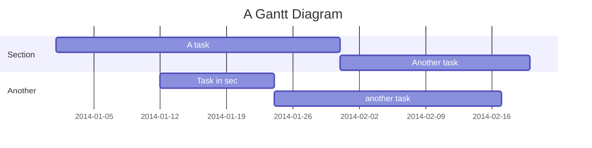

# test-repo

A repo for the most weird git experiments.

Yet another commit to test squashing commits that are on remote already.

Update `origin/master` on remote 181204-1227

`README.md`: update `origin/master` on remote 181204-1232 to test `feature` rebase 
on amended file.

Add a change on `master`.

---

Attempt to embed youtube
<iframe width="560" height="315" src="https://www.youtube.com/embed/HEmsj3qRhig" frameborder="0" allow="accelerometer; autoplay; encrypted-media; gyroscope; picture-in-picture" allowfullscreen></iframe>

---

https://mermaid-js.github.io/mermaid/#/integrations // https://github.com/mermaid-js/mermaid

